# Signet-Web
## 主要功能
 - [x] 项目管理
 - [x] 卡密校验
 - [x] 用户管理
 - [x] 支持代理端
 - [x] 代理点数控制 
 - [x] 数据统计
 - [x] 一次性密
 - [x] 时间卡密
 - [x] 用户管理
 - [x] API密钥
 - [x] QQ发卡
 - [x] 校验记录
 - [x] 移动端UI
 - [x] WebUI
 - [ ] 等待开发....

## 调用支持
易语言、GO语言、C语言、C++、HTTP API。  
可以支持任何语言调用，欢迎咨询，调用库是动态维护的，遇到客户需要的时候会去支持。
## 维护状态
- [ ] 一键加验证(马上支持)
- [ ] 多语言调用(动态维护)
- [ ] GRPC
- [ ] 支持mysql(有需要的时候会对接)
- [ ] 支持redis(有需要的时候会对接)

## 相关使用截图
### PC端
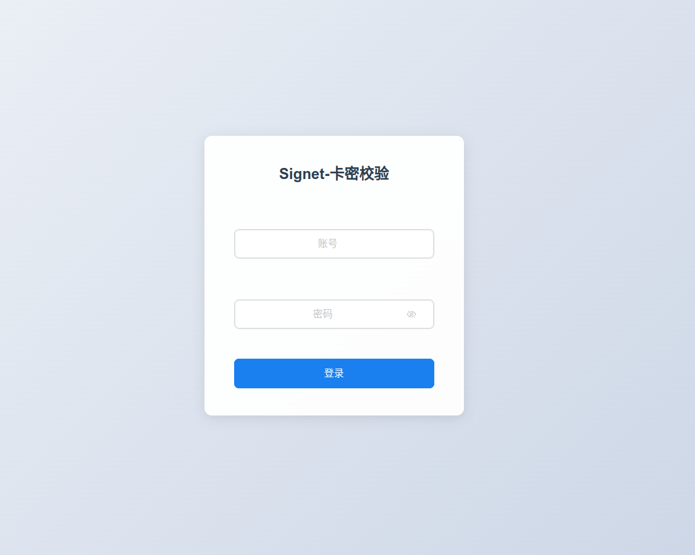
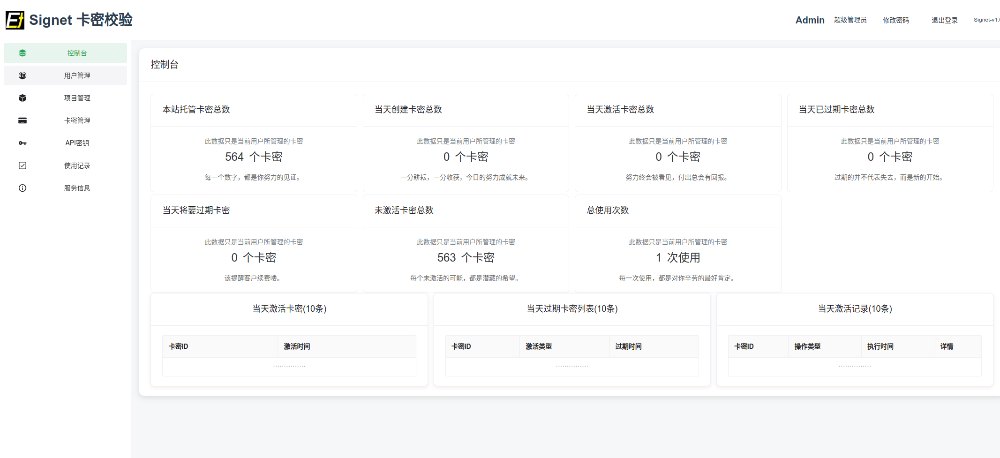
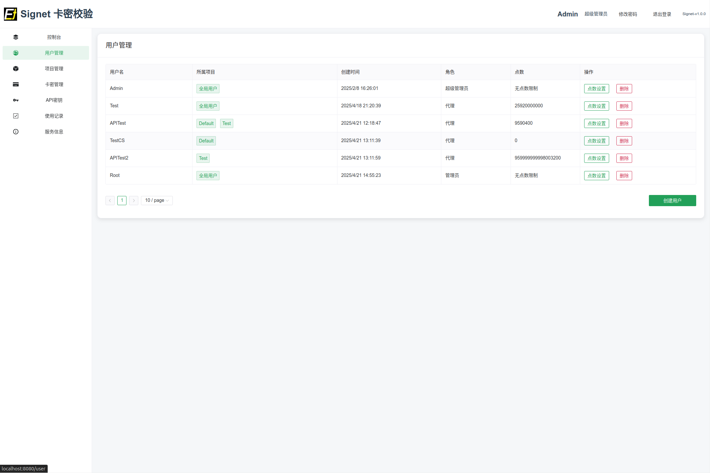
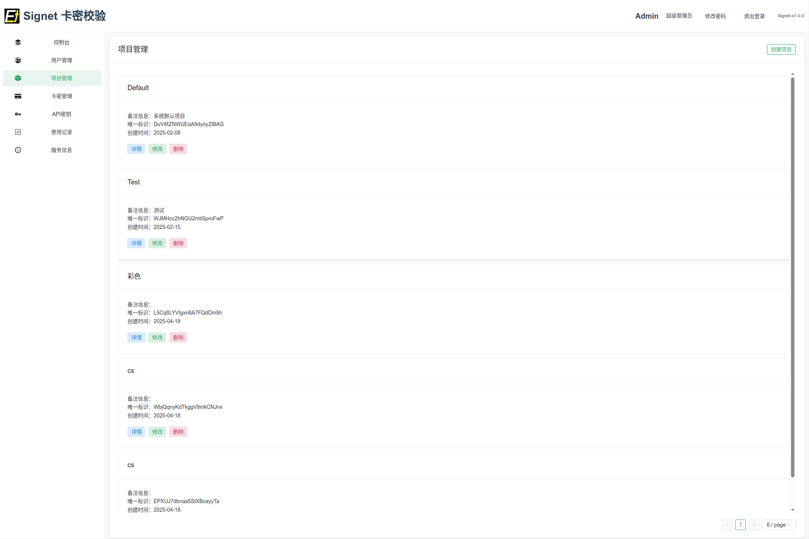
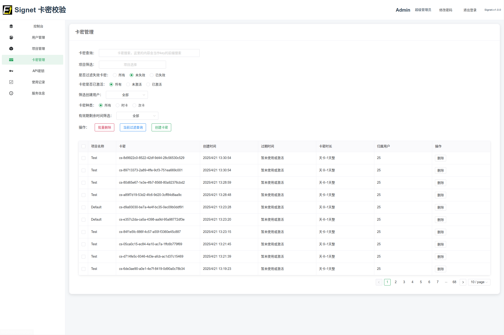
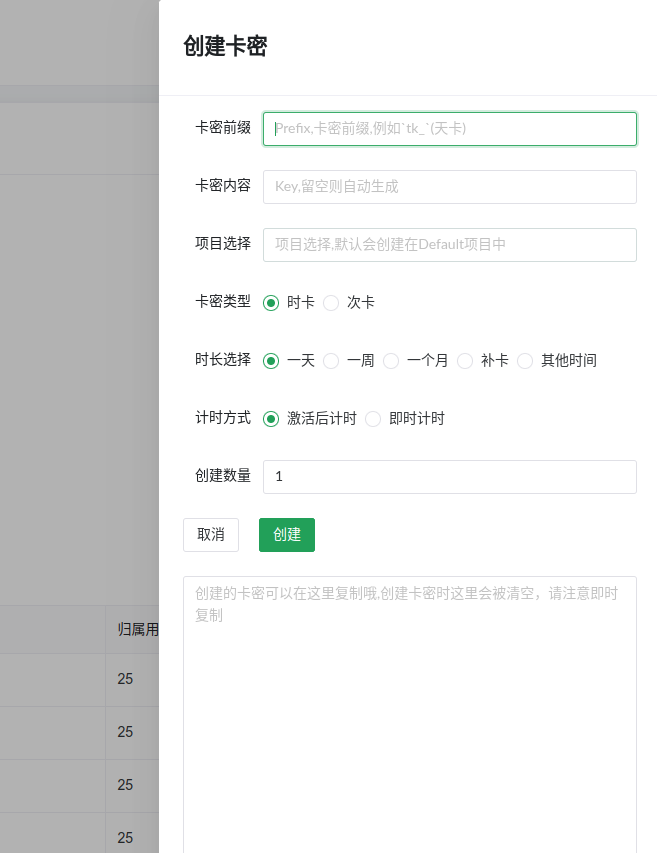
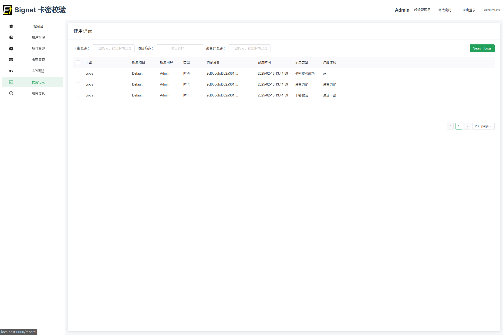
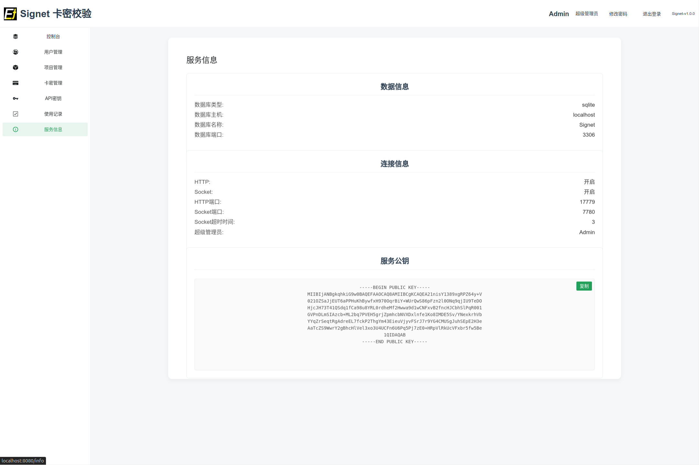

### 移动端
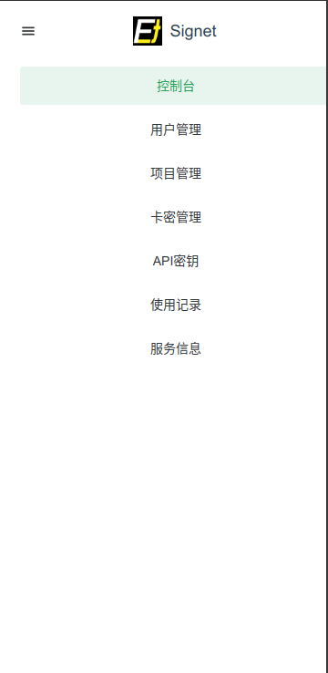
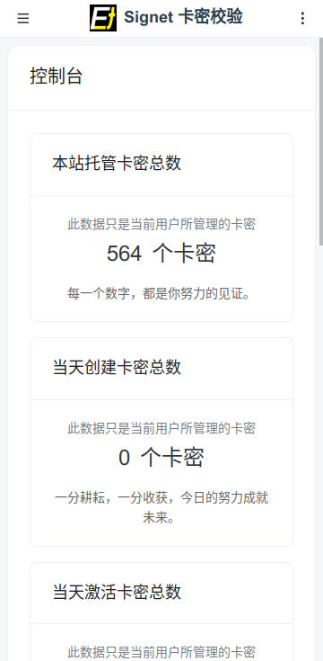
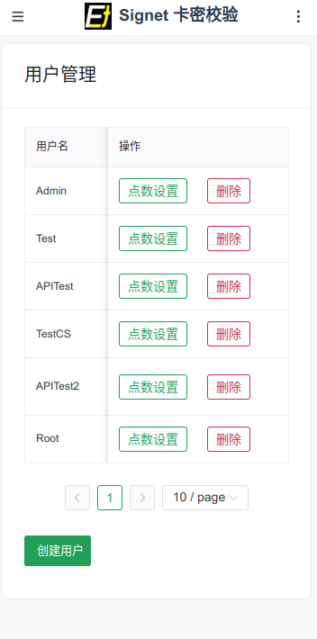
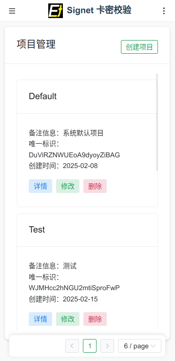
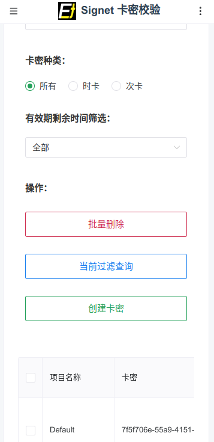
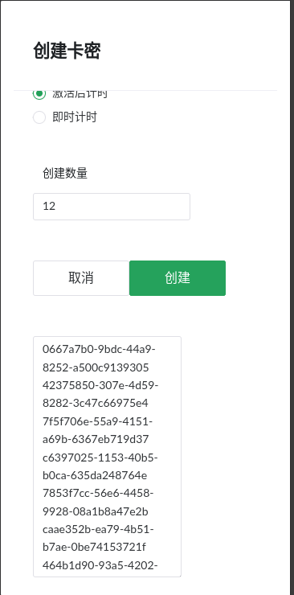
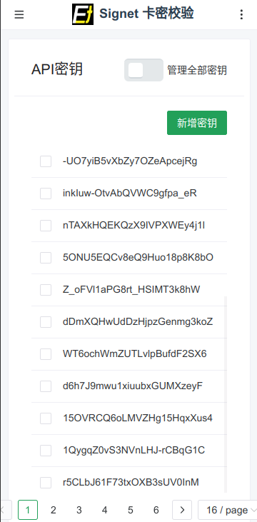
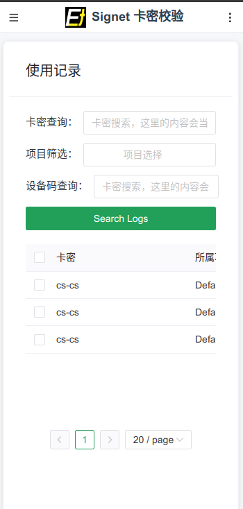
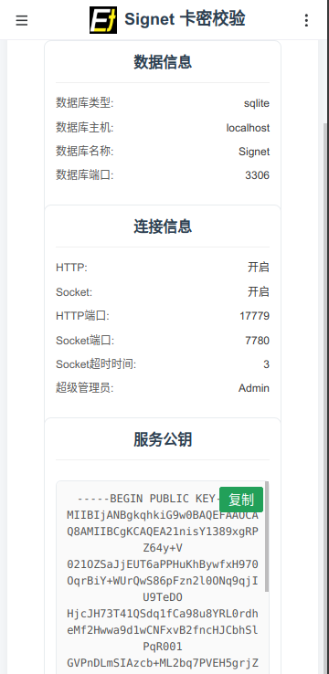

### 其他
代理端只有部分功能

## 使用咨询
🐧： 2023433256

## 使用协议
卡密系统使用声明

本卡密系统（以下简称“本系统”）由Signet开发，仅限用于合法、正规且经授权的目的。用户在使用本系统时，必须严格遵守本声明及适用的法律法规。

一、合法使用原则
本系统仅可用于开发者明确指定的合法用途，例如“正版软件激活”或“授权服务访问”。
用户须确保其使用行为符合相关国家或地区的法律法规，并不得违反任何第三方权益。

二、禁止非法及不当使用
严禁将本系统用于任何非法或未经授权的活动，包括但不限于：
开发、传播或使用外挂、作弊工具、破解软件或其他破坏公平性或合法性的程序；
从事欺诈、盗窃、侵犯知识产权、非法访问系统或传播违法内容等行为；
其他违反法律法规或公序良俗的行为。
任何形式的未经授权的卡密生成、篡改、倒卖或滥用行为均被严格禁止。

三、责任声明
用户对其使用本系统的行为承担全部责任。对于因非法或不当使用本系统导致的任何法律、经济或其他后果，Signet及相关方概不负责。
用户应自行承担因违反本声明或相关法律法规所引发的全部法律责任及经济损失。

四、违规处理
若发现用户存在非法或未经授权的使用行为，Signet有权立即采取以下措施：
暂停或终止用户的使用权限；
没收相关卡密或取消其有效性；
配合执法机构调查并追究用户的法律责任。
对于情节严重的违规行为，Signet保留进一步追究赔偿及法律责任的权利。

五、声明效力 用户使用本系统即视为已充分理解并同意本声明的所有条款。本声明自发布之日起生效，Signet保留随时更新本声明的权利。

如有疑问，请联系：admin@boychai.xyz。

使用即代表了解并且认同且愿意遵循本声明

Signet
发布日期：2025年4月21日